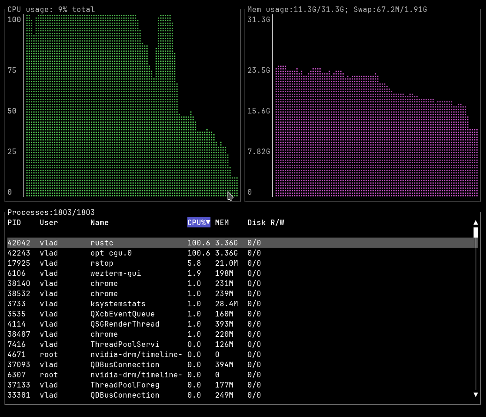

## rstop -- Interactive cross-platform process manager.

Rstop is a simple lightweight process manager written in Rust. It works on Windows, Linux and FreeBSD.

Unicode fonts with Braille patterns are highly recommended, as rstop uses them to render 2D plots.

### Keymap:

<kbd>Q</kbd> -- Quit;

<kbd>1</kbd> .. <kbd>6</kbd> -- Sort by column 1..6, change sort order;

<kbd>Up</kbd>, <kbd>Down</kbd>, <kbd>PgUp</kbd>, <kbd>PgDn</kbd>, <kbd>Home</kbd>, <kbd>End</kbd> -- navigate process table;

<kbd>/</kbd> -- Open Filter dialog. In Filter dialog, use alphanumeric keys and  <kbd>Backspace</kbd> to enter filter string, <kbd>Enter</kbd> to accept filter string and close the dialog, <kbd>Esc</kbd> to clear filter string or close the dialog if the filter string is empty;

<kbd>K</kbd> -- Open Kill dialog;
